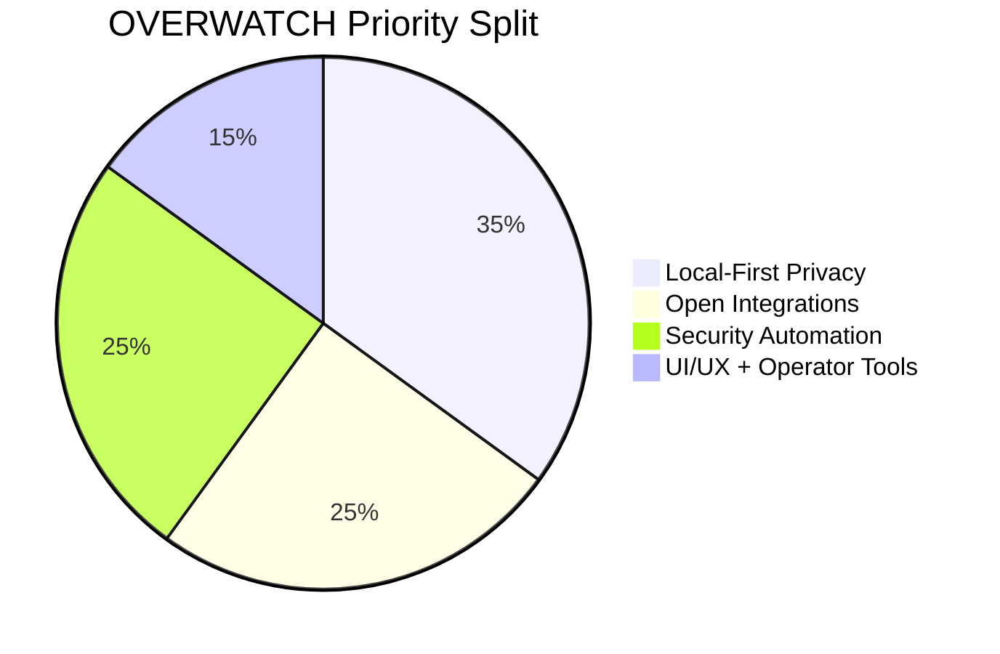
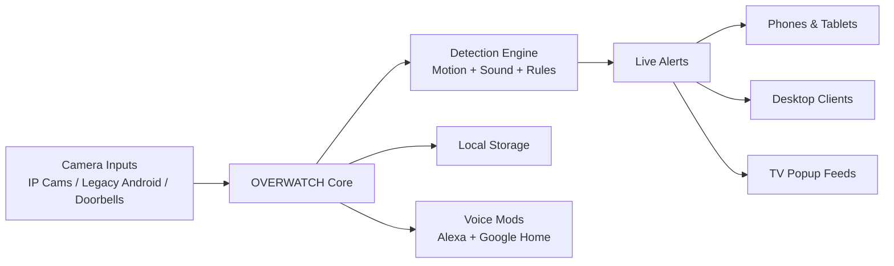

# **Project Name: OVERWATCH**
## **Sub-brand: The Blacklisted Distro**

<p align="center">
  
  
  
</p>

---

> “We looked at the ‘smart home’ landscape—a gated community of subscription fees and data-mining doorbells—and decided to kick the gates in.  
> At **Blacklisted Binary Labs**, we don’t do Basic Tiers.  
> We took Scrypted, de-loused the freemium parasites out of the logic, and rebuilt it into the open-source weapon it was meant to be.”

---

## 🛰️ What This Is

**OVERWATCH** is a local-first, open-source home video and security platform with a dark, tactical UI attitude and zero rent-seeking nonsense.

It pays homage to **Scrypted** for the foundation and ecosystem that made this possible.  
Our stance is simple: offering an open-source video platform and locking essential features behind subscriptions feels too close to a freemium bait-and-switch.  
We’re allergic to that model, so we removed the paywall-shaped dandruff and shipped a distro that stays free.

---

## 🧨 The Manifesto

Ring, Wyze, and Blink keep trying to sell people a monthly permission slip to use hardware they already bought.  
That’s not convenience. That’s a hostage negotiation with extra steps.

**OVERWATCH** exists to end that cycle:

- No gated core features.
- No “Pro unlock” traps.
- No cloud ransom notes.
- No surveillance tax.

If your device can do the work, **OVERWATCH** should let it.

---

## ⚙️ The “De-Loused” Feature Set

### **Zero-Gated Logic**
If the hardware can do it, the platform exposes it. Period.

### **Sovereign Local Storage**
Footage stays on your network and under your control.

### **Captain Save-a-Planet (E-Waste Rescue)**
Upcoming support turns old Android phones into instant wireless camera nodes, so dead tech drawers become active security mesh.

### **The Nervous System (Live Intercepts)**
- **Motion + Sound live alerts** with real-time eventing
- **Cross-device live popup feeds** to phones, tablets, desktops, and TVs
- **Armable security profiles** with far better tuning and sensitivity controls

### **Custom Graphics + Tactical UX**
Dark, alt-styled dashboards, event overlays, and operator-first panels built to look like a command center, not a thermostat app.

---

## 📊 Tactical Snapshot





---

## 🗺️ Future Intel (Roadmap)

We’re building an open-house ecosystem where all devices are welcome and everything stays free.

- **Multi-platform control surface:** Linux, macOS, Windows, and mobile clients with consistent control flows.
- **Android camera mesh (planned):** targeted one-command onboarding for retired Android devices as wireless cameras, with release docs to follow.
- **Custom Alexa and Google Home mods:** expanded local-first behavior and tighter automation hooks.
- **Upgraded armable security system:** richer zones, multi-signal triggering, and smarter alert logic.
- **Live camera notification popups everywhere:** including TV surfaces and shared household endpoints.
- **Overwatch Architect:** a “never-sleep” orchestration layer to simplify setup, automations, and policy management.

When this roadmap lands, subscription-first camera stacks are going to have a bad night.

---

## 🚀 Installation

Take back your hardware.

```bash
git clone https://github.com/crazyrob425/scryptedfree.git
cd scryptedfree
./npm-install.sh
```

---

## 🤝 Contributing

Contributions are welcome.  
If your PR adds value, performance, compatibility, or freedom, you’re family.

If your PR adds a “Subscribe” button to a core feature, this is probably not your stop.

---

## **Blacklisted Binary Labs**
### *Total Sovereignty. Zero Ransoms.*
